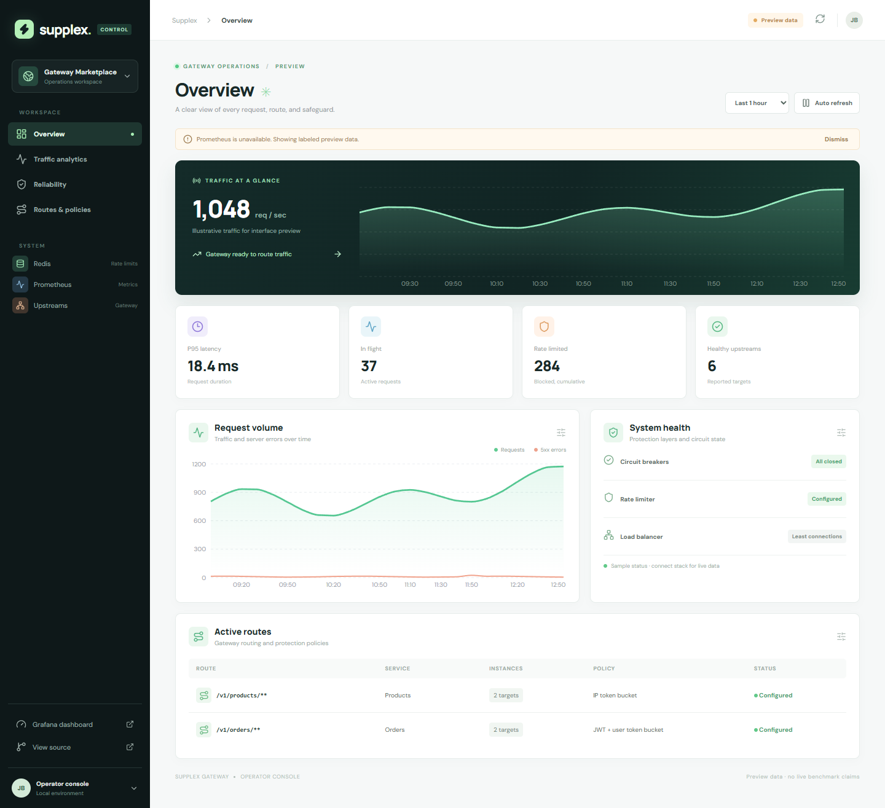
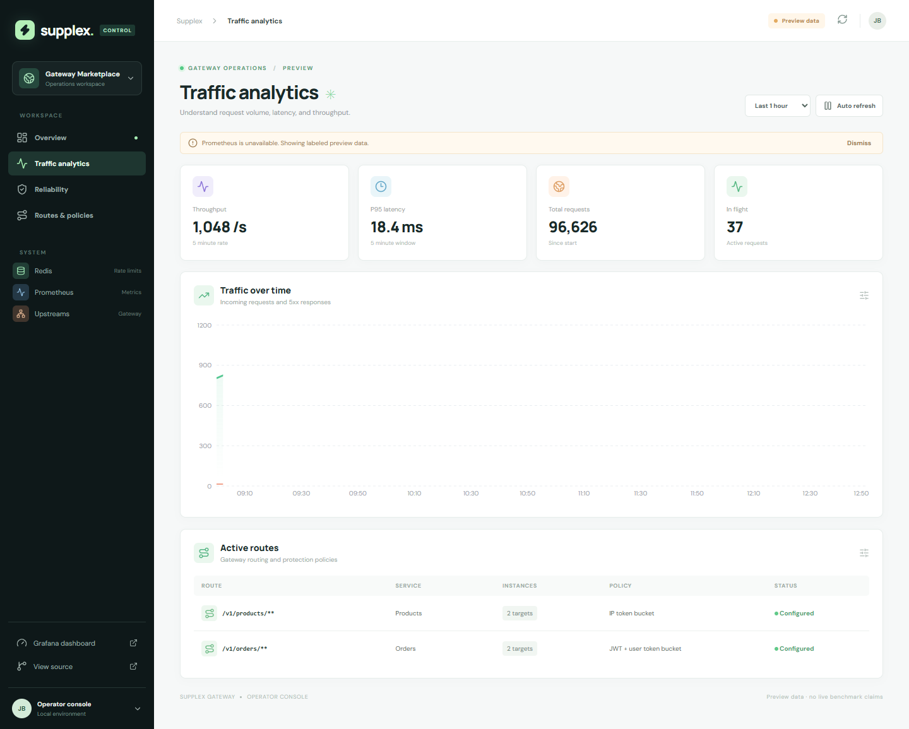
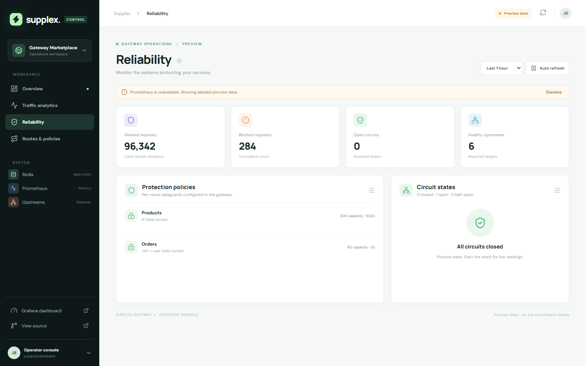
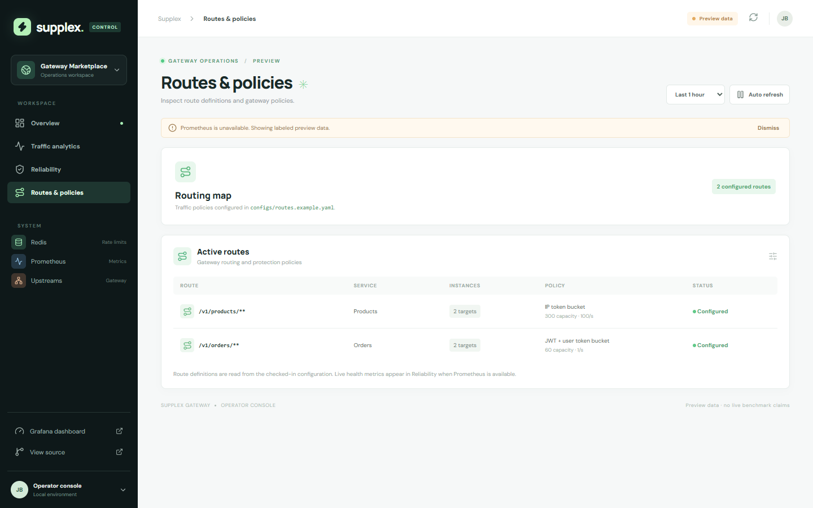
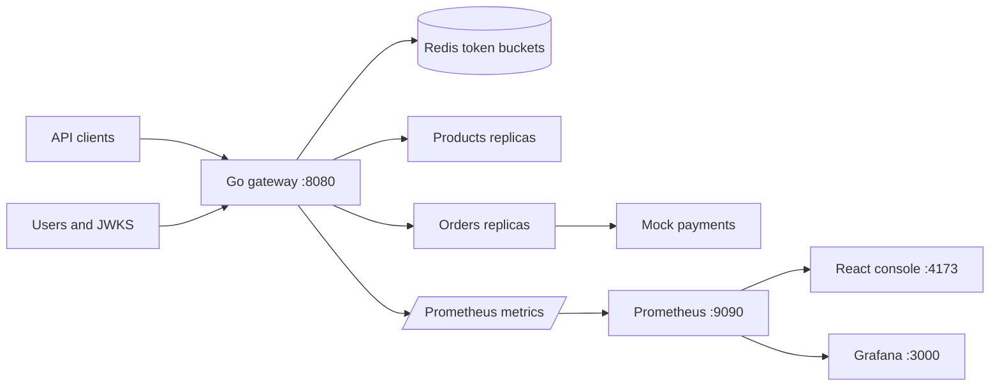

# Supplex Gateway

[](https://github.com/JustinBcodes/supplement-api-gateway/actions/workflows/ci.yml)
  



A Go API gateway for a mock supplements marketplace, paired with a React operations console. It demonstrates routing, Redis-backed rate limits, circuit breakers, JWT verification, least-connections balancing, and Prometheus metrics. The console turns those signals into a readable operational view.

## Explore the project

| Area | Implementation | Where to look |
| --- | --- | --- |
| Routing | Config-driven product and order routes with hot reload | [`configs/routes.example.yaml`](configs/routes.example.yaml), [`internal/config`](internal/config) |
| Rate limits | Atomic Redis token bucket Lua script and per-client keys | [`pkg/ratelimit`](pkg/ratelimit), [`internal/middleware/ratelimit.go`](internal/middleware/ratelimit.go) |
| Resilience | Least-connections selection, circuit states, GET/HEAD retry policy | [`internal/lb`](internal/lb), [`pkg/breaker`](pkg/breaker), [`internal/gateway`](internal/gateway) |
| Observability | Prometheus counters, gauges, histogram, and Grafana JSON | [`internal/obs`](internal/obs), [`dashboards/grafana.json`](dashboards/grafana.json) |
| Operator UI | Traffic charts, latency, circuit state, rate-limit totals, route policy views | [`frontend`](frontend) |
| Verification | Go unit/integration-style tests, React production build, loopback benchmark | [`tests`](tests), [`internal/gateway/server_test.go`](internal/gateway/server_test.go), [`docs/benchmark.md`](docs/benchmark.md) |

## Interface

The screenshots below use **labeled preview data** because they were captured without a running Prometheus server. When the stack is up, the UI queries Prometheus through its same-origin proxy and shows a **Live telemetry** indicator. Preview numbers are illustrative and are not benchmark results.

| Traffic analytics | Reliability | Route policies |
| --- | --- | --- |
|  |  |  |

## Architecture



The product, order, user, and payment services are **mock services** with in-memory data. PostgreSQL containers and migration files are included as a future persistence scaffold; the running services do not currently write to them. The gateway and console can be evaluated independently of those databases.

## Run locally

### Full Compose stack

```bash
docker compose -f docker-compose.yaml up --build
```

Open the [operator console](http://localhost:4173), [gateway health](http://localhost:8080/health), [Prometheus](http://localhost:9090), or [Grafana](http://localhost:3000). The console switches from preview to live metrics when Prometheus is reachable. Prometheus has useful request data after traffic passes through the gateway.

```bash
curl http://localhost:8080/v1/products
curl http://localhost:8080/metrics
```

### UI preview without Docker

```bash
cd frontend
npm ci
npm run dev
```

Open `http://localhost:4173`. The UI explicitly labels its preview state. To capture the committed screenshots, run `node scripts/capture.mjs` from `frontend` while the dev server is running. The script writes into `screenshots/`.

## Measured and tested

| Check | Result | Reproduce |
| --- | --- | --- |
| Go tests | Pass across gateway and test packages | `go test ./...` |
| Redis bucket behavior | Block, refill, and independent client buckets verified with miniredis | `go test ./tests -run TokenBucket` |
| Proxy routing | `httptest` upstream receives configured route and unmatched paths return 404 | `go test ./internal/gateway -run TestRoutes` |
| Frontend | TypeScript and Vite production build pass | `cd frontend && npm ci && npm run build` |
| Loopback proxy benchmark | Median **69.4 µs/op** across three runs on a Ryzen 9 9900X3D / Windows machine | [`docs/benchmark.md`](docs/benchmark.md) |

The loopback benchmark measures an in-process gateway handler and local `httptest` upstream. It is **not** a distributed load result or production RPS claim. The earlier README's unverified multi-replica throughput figures have been removed.

## Metrics surfaced in the console

| Signal | Prometheus series | Console view |
| --- | --- | --- |
| Requests | `gateway_requests_total` | Throughput and cumulative volume |
| P95 latency | `gateway_request_duration_seconds_bucket` | Latency card |
| Active requests | `gateway_requests_in_flight` | In-flight card |
| Rate limits | `gateway_ratelimit_allowed_total`, `gateway_ratelimit_blocked_total` | Reliability view |
| Circuit and upstream state | `gateway_cb_state`, `gateway_upstream_healthy` | Health view |

## Scope and safety

This is an engineering demo, not a hosted production gateway. The user service accepts demo credentials; the databases are scaffolded; and the operator console has no account authentication. Redis failures currently allow requests through. Run it on a trusted local network and add authentication, TLS, and fail-mode decisions before internet exposure.
